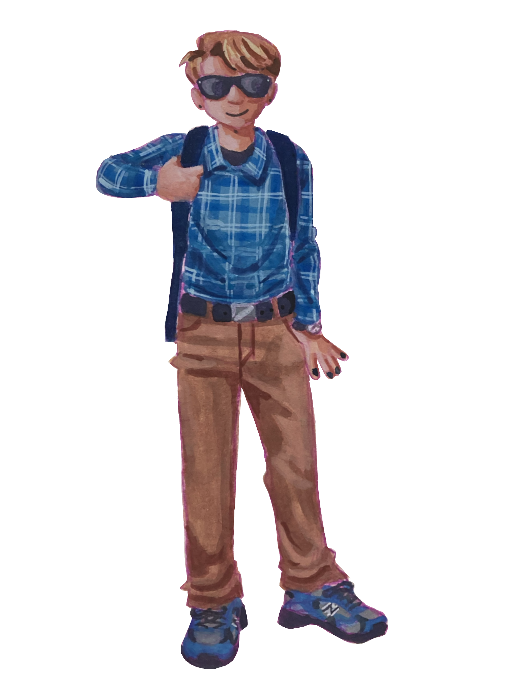
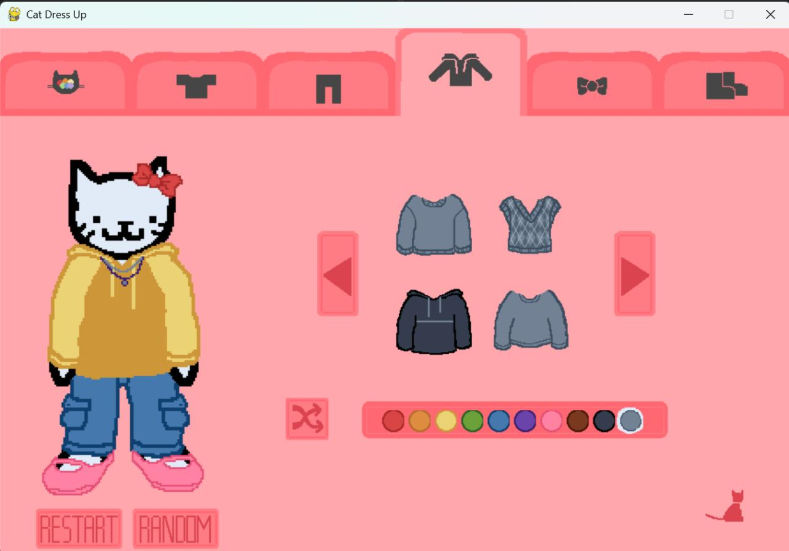

## Hello all, I'm Riley!
### About Me:
I'm a senior software engineering student at Indiana Tech with experience as a Full-Stack Developer Intern. I tutor math and computer science for my school and aspire to work in back-end or full-stack development. I'm an artist and made the drawings for this account (like that super cool painting of me right there and my profile picture)! I love problem-solving and learning, especially new technologies, and I'm always up for a challenge! 

### Technologies: 
- Languages: Python, Java, C++, C#, TypeScript, SQL (MS SQL Server, SQLite)
- Front-end: HTML, CSS, React, Material UI
- Back-end: ASP.NET, Node.js, Dapper ORM
- Tools: Visual Studio, VS Code, Git, GitHub, GitLab, Docker, Jira
### Contact Me:
[linkedin.com/in/riley-rachels/](https://www.linkedin.com/in/riley-rachels/)  
 reddrileyrachels@gmail.com
### Favorite Projects: 
- [Tutor Bookings](https://github.com/reddRileyRachels/TutorBookings) (HTML/CSS/C#/ASP.NET/SQLite/Dapper)
  - Tutor scheduling web application that supports recurring appointments
  - Multi-interdependent form fields
  - Dynamic content
  - 8 table relational database schema 
- [Linear Algebra Calculator](https://github.com/reddRileyRachels/LinearAlgebraCalculator) (Python/NumPy/Pygame)
  - Systems of linear equations calculator that shows each step to the user
  - Uses a Gaussian elimination algorithm showing all matrix row operations
  - Collaborative
  
- [Cat Dress Up Game](https://github.com/reddRileyRachels/catDressUpPygame) (Python/Pygame)
  - Dress up game that is cat themed
  - Multiple tabs with clothing selection carousels and color selection 
  - Randomize and reset buttons
  - Original pixel art

##### Credit For Icons: 
<a href="https://www.flaticon.com/free-icons/linkedin" title="linkedin icons">Linkedin icons created by riajulislam - Flaticon</a> 
<a href="https://www.flaticon.com/free-icons/email" title="email icons">Email icons created by Magnific - Flaticon</a>
